

# Build with your AI agents, add taste with Alpy MCP.

Connect Alpy MCP and put a creative director behind every AI build. 
You get a complete design system and 37 design skills for consistent and intentional UI and UX designs.

Alpy MCP brings your Alpy Library’s components, tokens, design skills, and web design styles into Claude, Codex, Cursor, Gemini, and Figma. Your AI works with your connected Library while you choose the direction and review the result.

[Explore Alpy](https://alpymcp.com/) · [Browse AI Taste](https://alpymcp.com/ai-taste) · [Connect Alpy MCP](https://alpymcp.com/ai-taste#ai-taste-install-title)

https://github.com/user-attachments/assets/6e7765aa-0c62-4097-b63e-058951fc2829

## Contents

- [Web design style skills](#web-design-style-skills)
- [Design Skills](#design-skills)
- [Run the examples](#run-the-examples)
- [Inside Alpy MCP](#inside-alpy-mcp)
- [Get started](#get-started)
- [Discover Alpy with your AI](#discover-alpy-with-your-ai)

## Web design style skills

Explore 13 website prototypes from Alpy Taste. Open a preview to see the full website, then explore the Website Design guidance to shape your own project.

<table>
<tr>
<td width="33%" valign="top">
<a href="https://alpymcp.com/websites/academia/index.html">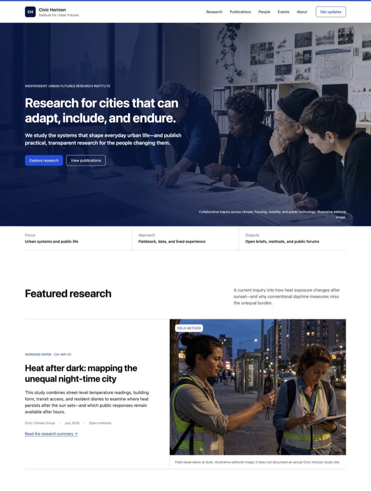</a> 
<strong>Academia</strong> 
Research institute 
<a href="https://alpymcp.com/websites/academia/index.html">Open prototype</a> · <a href="prototypes/academia/">Source</a> · <a href="https://alpymcp.com/ai-taste#ai-taste-website-design">Design guidance</a>
</td>
<td width="33%" valign="top">
<a href="https://alpymcp.com/websites/art-deco/index.html">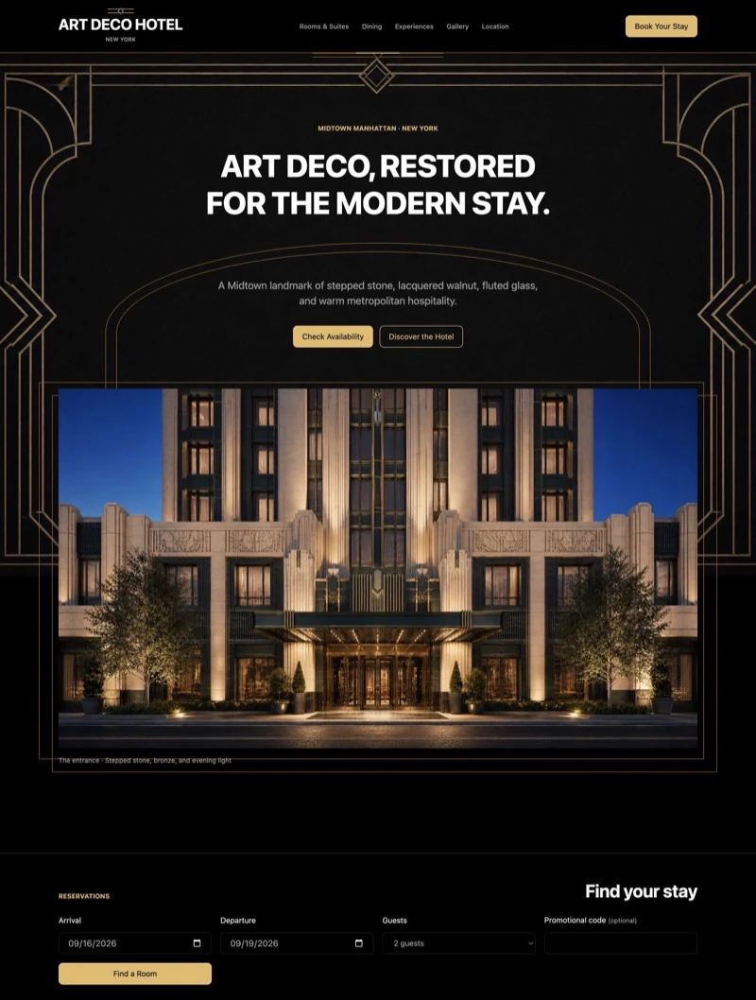</a> 
<strong>Art Deco</strong> 
Hotel and hospitality 
<a href="https://alpymcp.com/websites/art-deco/index.html">Open prototype</a> · <a href="prototypes/art-deco/">Source</a> · <a href="https://alpymcp.com/ai-taste#ai-taste-website-design">Design guidance</a>
</td>
<td width="33%" valign="top">
<a href="https://alpymcp.com/websites/bauhaus/index.html">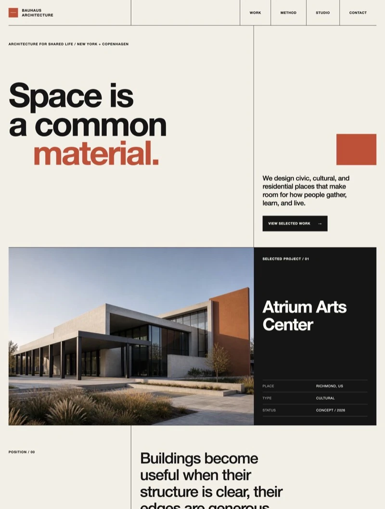</a> 
<strong>Bauhaus</strong> 
Architecture collective 
<a href="https://alpymcp.com/websites/bauhaus/index.html">Open prototype</a> · <a href="prototypes/bauhaus/">Source</a> · <a href="https://alpymcp.com/ai-taste#ai-taste-website-design">Design guidance</a>
</td>
</tr>
<tr>
<td width="33%" valign="top">
<a href="https://alpymcp.com/websites/bento-grid/index.html">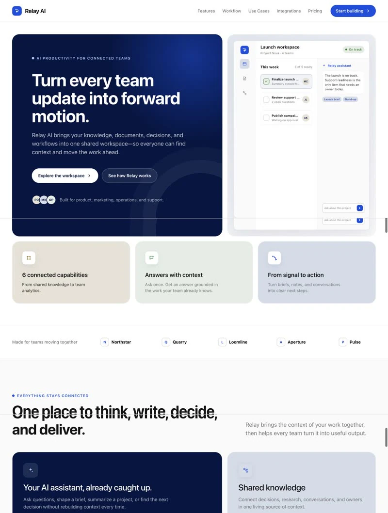</a> 
<strong>Bento Grid</strong> 
AI collaboration 
<a href="https://alpymcp.com/websites/bento-grid/index.html">Open prototype</a> · <a href="prototypes/bento-grid/">Source</a> · <a href="https://alpymcp.com/ai-taste#ai-taste-website-design">Design guidance</a>
</td>
<td width="33%" valign="top">
<a href="https://alpymcp.com/websites/bold-typography/index.html">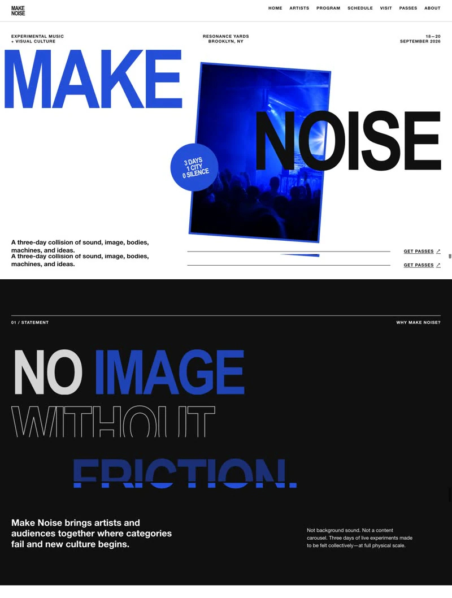</a> 
<strong>Bold Typography</strong> 
Music and culture 
<a href="https://alpymcp.com/websites/bold-typography/index.html">Open prototype</a> · <a href="prototypes/bold-typography/">Source</a> · <a href="https://alpymcp.com/ai-taste#ai-taste-website-design">Design guidance</a>
</td>
<td width="33%" valign="top">
<a href="https://alpymcp.com/websites/Cyberpunk/index.html">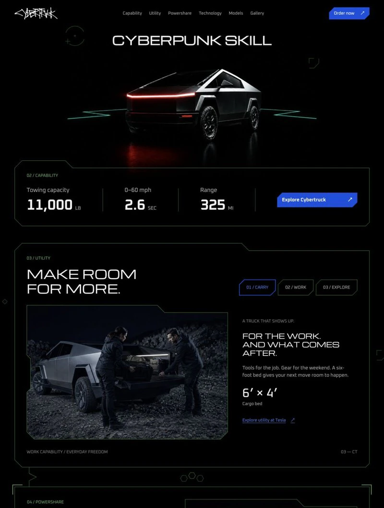</a> 
<strong>Cyberpunk</strong> 
Automotive 
<a href="https://alpymcp.com/websites/Cyberpunk/index.html">Open prototype</a> · <a href="prototypes/Cyberpunk/">Source</a> · <a href="https://alpymcp.com/ai-taste#ai-taste-website-design">Design guidance</a>
</td>
</tr>
<tr>
<td width="33%" valign="top">
<a href="https://alpymcp.com/websites/flat-design/index.html">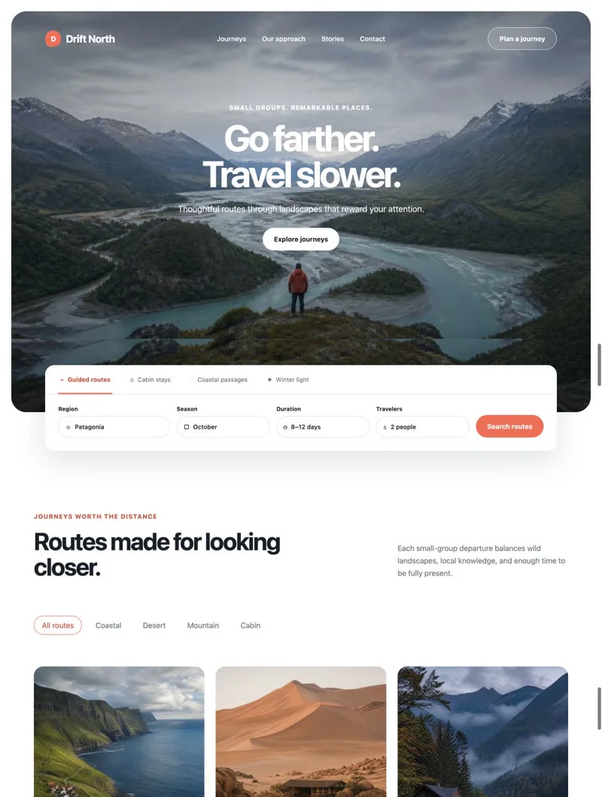</a> 
<strong>Flat Design</strong> 
Travel and journeys 
<a href="https://alpymcp.com/websites/flat-design/index.html">Open prototype</a> · <a href="prototypes/flat-design/">Source</a> · <a href="https://alpymcp.com/ai-taste#ai-taste-website-design">Design guidance</a>
</td>
<td width="33%" valign="top">
<a href="https://alpymcp.com/websites/Grunge/index.html">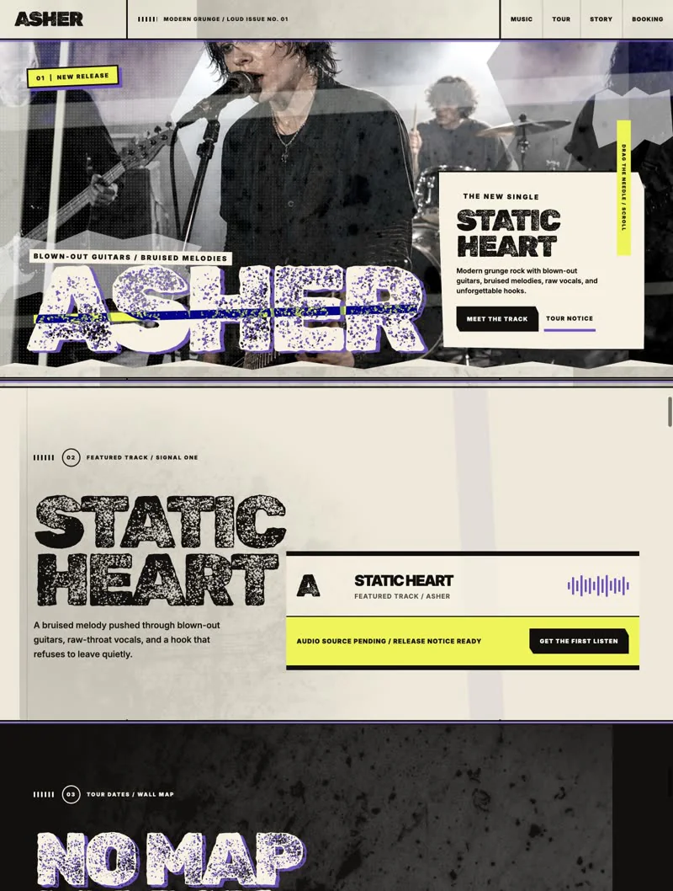</a> 
<strong>Grunge / Punk</strong> 
Artist and music 
<a href="https://alpymcp.com/websites/Grunge/index.html">Open prototype</a> · <a href="prototypes/Grunge/">Source</a> · <a href="https://alpymcp.com/ai-taste#ai-taste-website-design">Design guidance</a>
</td>
<td width="33%" valign="top">
<a href="https://alpymcp.com/websites/Modern-dark/index.html">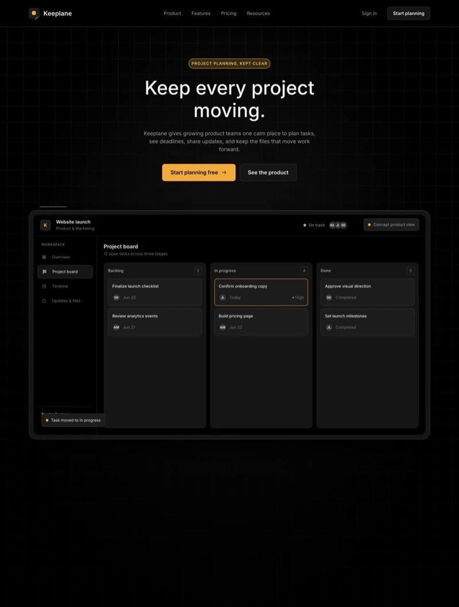</a> 
<strong>Modern Dark</strong> 
Project management 
<a href="https://alpymcp.com/websites/Modern-dark/index.html">Open prototype</a> · <a href="prototypes/Modern-dark/">Source</a> · <a href="https://alpymcp.com/ai-taste#ai-taste-website-design">Design guidance</a>
</td>
</tr>
<tr>
<td width="33%" valign="top">
<a href="https://alpymcp.com/websites/neumorphism/index.html">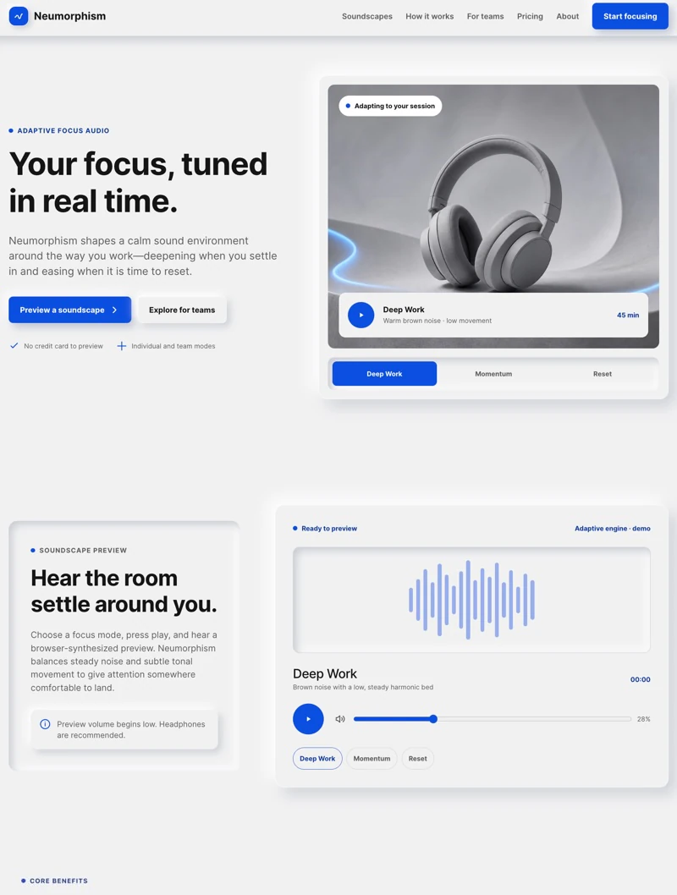</a> 
<strong>Neumorphism</strong> 
Focus and audio 
<a href="https://alpymcp.com/websites/neumorphism/index.html">Open prototype</a> · <a href="prototypes/neumorphism/">Source</a> · <a href="https://alpymcp.com/ai-taste#ai-taste-website-design">Design guidance</a>
</td>
<td width="33%" valign="top">
<a href="https://alpymcp.com/websites/Parallax/index.html">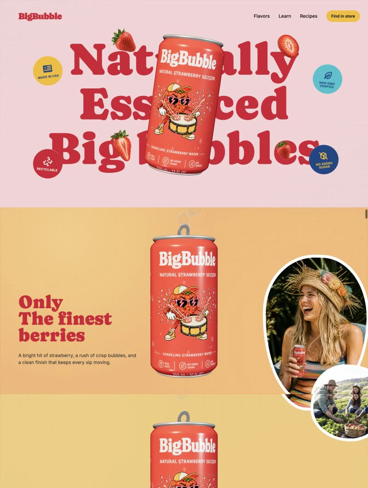</a> 
<strong>Parallax</strong> 
Beverage brand 
<a href="https://alpymcp.com/websites/Parallax/index.html">Open prototype</a> · <a href="prototypes/Parallax/">Source</a> · <a href="https://alpymcp.com/ai-taste#ai-taste-website-design">Design guidance</a>
</td>
<td width="33%" valign="top">
<a href="https://alpymcp.com/websites/Playful-geometric/index.html">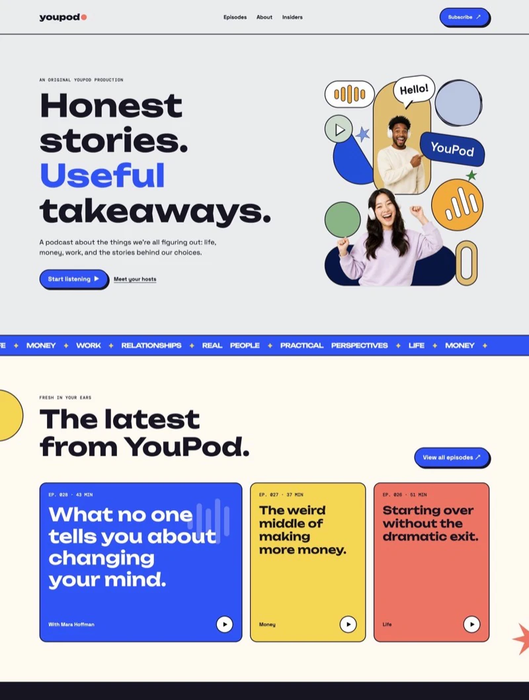</a> 
<strong>Playful Geometric</strong> 
Podcast and media 
<a href="https://alpymcp.com/websites/Playful-geometric/index.html">Open prototype</a> · <a href="prototypes/Playful-geometric/">Source</a> · <a href="https://alpymcp.com/ai-taste#ai-taste-website-design">Design guidance</a>
</td>
</tr>
<tr>
<td width="33%" valign="top">
<a href="https://alpymcp.com/websites/swiss/index.html">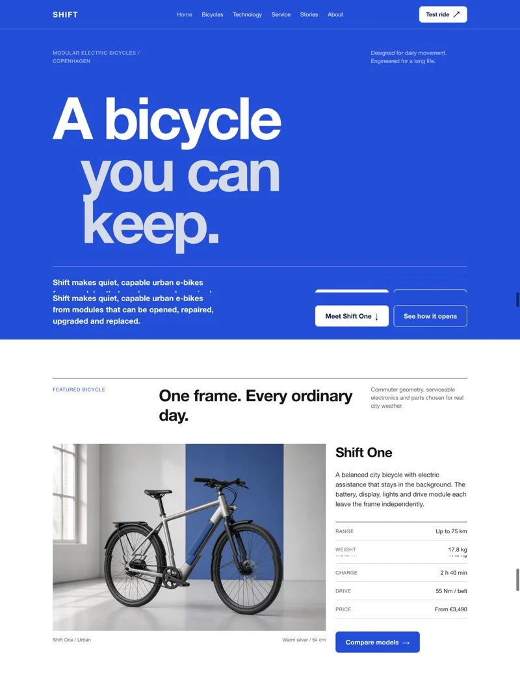</a> 
<strong>Swiss</strong> 
Urban mobility 
<a href="https://alpymcp.com/websites/swiss/index.html">Open prototype</a> · <a href="prototypes/swiss/">Source</a> · <a href="https://alpymcp.com/ai-taste#ai-taste-website-design">Design guidance</a>
</td>
<td width="33%"></td>
<td width="33%"></td>
</tr>
</table>

[Explore all web design styles on Alpy Taste](https://alpymcp.com/ai-taste#ai-taste-gallery-title)

## Design Skills

Create, explore, and refine interfaces with your Alpy Library.

<table>
<tr>
<td width="33%" valign="top"><a href="#ui-design">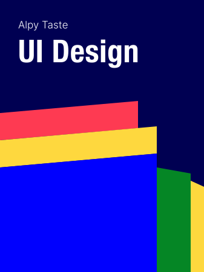</a> <strong>UI Design</strong> <a href="#ui-design">12 visual principles</a></td>
<td width="33%" valign="top"><a href="#website-design">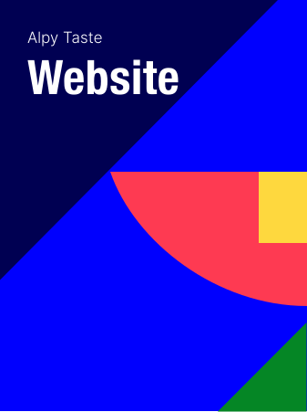</a> <strong>Website Design</strong> <a href="#website-design">From brief to website</a></td>
<td width="33%" valign="top"><a href="#user-experience">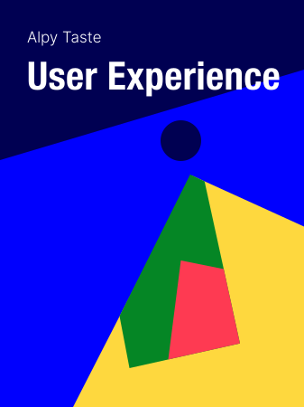</a> <strong>User Experience</strong> <a href="#user-experience">12 UX principles</a></td>
</tr>
</table>

### UI Design

Shape clear, consistent interfaces through 12 visual principles.

| Principle | What it guides |
|---|---|
| Rhythm and Space | Give content room and a steady pace. |
| Motion and Transition | Explain changes without slowing tasks. |
| Grid and Layout | Organize content across screen sizes. |
| Alignment | Keep text, fields, and values on clear visual lines. |
| Scale and Proportion | Size elements for their importance. |
| Visual Hierarchy | Lead attention to key content and actions. |
| Balance | Distribute visual weight across the screen. |
| Gestalt | Group related content and distinguish active layers. |
| Color Discipline | Use Library colors consistently and legibly. |
| Typography and Readability | Keep headings, labels, and data easy to read. |
| Border and Divider | Clarify boundaries and selected states. |
| Elevation | Separate floating controls from background content. |

[UI Design guidance](https://alpymcp.com/ai-taste#ai-taste-ui-design) · [Starter prompt](prompts/refine-ui.md)

### Website Design

Turn an idea or existing site into a responsive website around your audience, content, and goals.

1. **Share your idea.** Describe what to create or redesign.
2. **Choose a style.** Review prototypes and select a direction.
3. **Choose a hero.** Set the opening message, visual, and action.
4. **Approve the brief.** Confirm the goals, content, style, and hero.
5. **Review and refine.** Build with your Library, then request focused revisions.

[Website Design guidance](https://alpymcp.com/ai-taste#ai-taste-website-design) · [Starter prompt](prompts/build-website.md)

### User Experience

Design around real user needs, clear tasks, and predictable behavior.

| Principle | What it guides |
|---|---|
| User-centricity | Start with user needs and evidence. |
| Usability | Make tasks easy to learn and complete. |
| Consistency | Keep language and behavior predictable. |
| Context | Account for devices, abilities, and interruptions. |
| Hierarchy | Clarify priorities, prerequisites, and consequences. |
| Navigation and orientation | Show location, destinations, and next steps. |
| Simplicity | Keep the content and controls people need. |
| Cognitive load | Reduce memory demands with recognizable choices. |
| User control | Make saving, cancellation, and supported undo clear. |
| Feedback and closure | Explain progress, outcomes, and next steps. |
| Error prevention and recovery | Prevent mistakes and preserve work during recovery. |
| Readability and scannability | Use plain language and descriptive headings. |

[User Experience guidance](https://alpymcp.com/ai-taste#ai-taste-user-experience) · [Starter prompt](prompts/review-ux.md)

## Run the examples

Each prototype includes its HTML, styles, scripts, assets, and a starter prompt. Preview the collection with a simple local server. Two examples also include source and optional build scripts.

[Local preview guide](docs/local-preview.md) · [Prototype files](prototypes/)

## Inside Alpy MCP

### Your Alpy design system

Customize typography, colors, tokens, and components in one Alpy Library. Bring those design decisions into your AI workflow across Light and Dark modes.

[Explore the Alpy design system](https://alpymcp.com/library)

### Taste and design skills

Give your AI a visual direction with web design styles, UI principles, and UX guidance. Review and refine your work with responsive, accessibility, and design system guidance.

[Explore Alpy Taste](https://alpymcp.com/ai-taste)

### Ready to build

Use React and Vue components from your connected Alpy Library through Alpy MCP, or bring your design system into a connected Figma workflow.

[React components](https://alpymcp.com/ai-taste#ai-taste-components-react) · [Vue components](https://alpymcp.com/ai-taste#ai-taste-components-vue) · [Figma connection guide](https://alpymcp.com/ai-taste?client=figma#ai-taste-install-title)

## Get started

1. **Set up your Alpy Library.** Customize the typography, colors, and components you want your AI to use.
2. **Connect your AI tool.** Follow its setup guide, sign in to Alpy, and choose your Library.
3. **Describe your project.** Share your goal, audience, content, and constraints. Choose a direction, approve the brief, then review and refine the result.

[Claude](https://alpymcp.com/ai-taste?client=claude#ai-taste-install-title) · [Codex](https://alpymcp.com/ai-taste?client=codex#ai-taste-install-title) · [Cursor](https://alpymcp.com/ai-taste?client=cursor#ai-taste-install-title) · [Gemini](https://alpymcp.com/ai-taste?client=gemini#ai-taste-install-title) · [Figma](https://alpymcp.com/ai-taste?client=figma#ai-taste-install-title)

An Alpy account and an eligible plan are required to connect. [See current plans](https://alpymcp.com/pricing).

## Discover Alpy with your AI

After connecting Alpy MCP, ask your AI to show what your Library contains. Select light or dark mode in your chat before requesting library content.

> Use Alpy MCP to show the full library index, no summary.

[Read the Alpy MCP Overview](https://alpymcp.com/alpy-mcp-overview/) · [More discovery prompts](prompts/discover-alpy.md)

Explore styles, UI and UX guidance, hero structures, components, tokens, responsive design, and accessibility with your connected AI.

[Website](https://alpymcp.com/) · [AI Taste](https://alpymcp.com/ai-taste) · [Pricing](https://alpymcp.com/pricing) · [Support](mailto:info@alpymcp.com) · [X](https://x.com/alpymcp) · [LinkedIn](https://www.linkedin.com/company/alpymcp)

Examples and previews are published by Alpy. [Terms](https://alpymcp.com/terms) · [Privacy](https://alpymcp.com/privacy)
