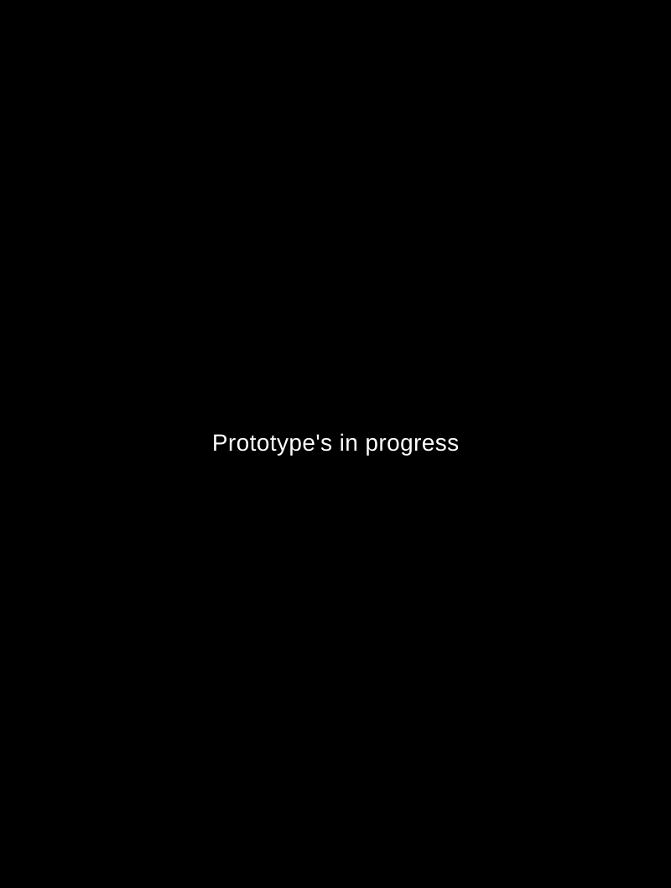

# Build with your AI agents, add taste with Alpy MCP.

https://github.com/user-attachments/assets/6e7765aa-0c62-4097-b63e-058951fc2829

Connect Alpy MCP and put a creative director behind every AI build.<br>
You get a complete design system and 37 design skills for consistent and intentional UI and UX designs.

Alpy MCP brings your Alpy Library’s components, tokens, design skills, and web design styles into Claude, Codex, Cursor, Gemini, and Figma. Your AI works with your connected Library while you choose the direction and review the result.

**Connect Alpy MCP to your AI**

<p>
<a href="https://alpymcp.com/ai-taste?client=cursor#ai-taste-install-title"></a>&ensp;
<a href="https://alpymcp.com/ai-taste?client=codex#ai-taste-install-title"></a>&ensp;
<a href="https://alpymcp.com/ai-taste?client=claude#ai-taste-install-title"></a>&ensp;
<a href="https://alpymcp.com/ai-taste?client=gemini#ai-taste-install-title"></a>&ensp;
<a href="https://alpymcp.com/ai-taste?client=figma#ai-taste-install-title"></a>
</p>

**Alpy MCP endpoint**

```text
https://www.alpymcp.com/alpy-mcp
```

### Contents

- [Design system](#design-system)
- [Taste and design skills](#taste-and-design-skills)
  - [Website Design](#website-design)
  - [UI Design](#ui-design)
  - [User Experience](#user-experience)
- [Ready to build](#ready-to-build)

---

### Inside Alpy MCP

### Design system

Customize typography, colors, tokens, and components in one Alpy Library. Bring those design decisions into your AI workflow across Light and Dark modes.

<details>
<summary><strong>Typography</strong></summary>

The type scale generator stays synced with your heading and body text styles.

- Font sizes
- Font weights
- Line heights
- Letter spacing

</details>

<details>
<summary><strong>Color</strong></summary>

The color generator keeps your palette synced with the colors used across your Library.

- Color shades
- System colors
- Surface colors
- Functional colors
- Border colors
- Text colors
- Icon colors
- Shadow colors

</details>

<details>
<summary><strong>Tokens</strong></summary>

Foundation and semantic tokens define the shared values used across your design system.

**Foundation tokens:**

- Size
- Typography: headings, body text, and font weights

**Semantic tokens:**

- Color
- Spacing
- Border
- Icon
- Shadow

</details>

<details>
<summary><strong>Components</strong></summary>

Foundation tokens → Semantic tokens → Component tokens

- Sizes
- Variants
- Interaction states
- Component Markdown files
- Production-ready React components
- Production-ready Vue components
- Light & Dark modes

</details>

[Explore the Alpy design system](https://alpymcp.com/library)

---

### Taste and design skills

### Website Design

Turn an idea or existing site into a responsive website around your audience, content, and goals.

1. **Your prompt**

   Share a new idea, an existing website, or one focused page, and describe what you want AI to create or redesign.

2. **Select a style**

   AI presents a prototype for each Alpy website style that fits the audience, goals, content, and brand, so you can review every direction before selecting one by name.

3. **Select a hero**

   AI presents hero directions that fit the selected style, key message, content, and primary action, then you choose how the website opens.

4. **Confirm the brief**

   AI clarifies your goals, audience, and requirements, then summarizes the brief, style, and hero for your approval.

5. **Review the output**

   AI builds the responsive website with your Alpy components, tokens, content, and assets, then you review the result and request focused revisions.

<table>
<tr>
<td width="33%" valign="top">
<a href="https://alpymcp.com/websites/academia/index.html"></a><br>
<strong>Academia</strong><br>
<a href="https://alpymcp.com/websites/academia/index.html">Open prototype</a> · <a href="prompts/styles/academia.md">Prompt</a>
</td>
<td width="33%" valign="top">
<a href="https://alpymcp.com/websites/art-deco/index.html"></a><br>
<strong>Art Deco</strong><br>
<a href="https://alpymcp.com/websites/art-deco/index.html">Open prototype</a> · <a href="prompts/styles/art-deco.md">Prompt</a>
</td>
<td width="33%" valign="top">
<a href="https://alpymcp.com/websites/bauhaus/index.html"></a><br>
<strong>Bauhaus</strong><br>
<a href="https://alpymcp.com/websites/bauhaus/index.html">Open prototype</a> · <a href="prompts/styles/bauhaus.md">Prompt</a>
</td>
</tr>
<tr>
<td width="33%" valign="top">
<a href="https://alpymcp.com/websites/bento-grid/index.html"></a><br>
<strong>Bento Grid</strong><br>
<a href="https://alpymcp.com/websites/bento-grid/index.html">Open prototype</a> · <a href="prompts/styles/bento-grid.md">Prompt</a>
</td>
<td width="33%" valign="top">
<a href="https://alpymcp.com/websites/bold-typography/index.html"></a><br>
<strong>Bold Typography</strong><br>
<a href="https://alpymcp.com/websites/bold-typography/index.html">Open prototype</a> · <a href="prompts/styles/bold-typography.md">Prompt</a>
</td>
<td width="33%" valign="top">
<a href="https://alpymcp.com/websites/Cyberpunk/index.html"></a><br>
<strong>Cyberpunk</strong><br>
<a href="https://alpymcp.com/websites/Cyberpunk/index.html">Open prototype</a> · <a href="prompts/styles/cyberpunk.md">Prompt</a>
</td>
</tr>
<tr>
<td width="33%" valign="top">
<a href="https://alpymcp.com/websites/flat-design/index.html"></a><br>
<strong>Flat Design</strong><br>
<a href="https://alpymcp.com/websites/flat-design/index.html">Open prototype</a> · <a href="prompts/styles/flat-design.md">Prompt</a>
</td>
<td width="33%" valign="top">
<a href="https://alpymcp.com/websites/Grunge/index.html"></a><br>
<strong>Grunge / Punk</strong><br>
<a href="https://alpymcp.com/websites/Grunge/index.html">Open prototype</a> · <a href="prompts/styles/grunge.md">Prompt</a>
</td>
<td width="33%" valign="top">
<br>
<strong>Luxury</strong><br>
<a href="prompts/styles/luxury.md">Prompt</a>
</td>
</tr>
<tr>
<td width="33%" valign="top">
<a href="https://alpymcp.com/websites/Modern-dark/index.html"></a><br>
<strong>Modern Dark</strong><br>
<a href="https://alpymcp.com/websites/Modern-dark/index.html">Open prototype</a> · <a href="prompts/styles/modern-dark.md">Prompt</a>
</td>
<td width="33%" valign="top">
<br>
<strong>Monochrome</strong><br>
<a href="prompts/styles/monochrome.md">Prompt</a>
</td>
<td width="33%" valign="top">
<br>
<strong>Neo Brutalism</strong><br>
<a href="prompts/styles/neo-brutalism.md">Prompt</a>
</td>
</tr>
<tr>
<td width="33%" valign="top">
<a href="https://alpymcp.com/websites/neumorphism/index.html"></a><br>
<strong>Neumorphism</strong><br>
<a href="https://alpymcp.com/websites/neumorphism/index.html">Open prototype</a> · <a href="prompts/styles/neumorphism.md">Prompt</a>
</td>
<td width="33%" valign="top">
<a href="https://alpymcp.com/websites/Parallax/index.html"></a><br>
<strong>Parallax</strong><br>
<a href="https://alpymcp.com/websites/Parallax/index.html">Open prototype</a> · <a href="prompts/styles/parallax.md">Prompt</a>
</td>
<td width="33%" valign="top">
<a href="https://alpymcp.com/websites/Playful-geometric/index.html"></a><br>
<strong>Playful Geometric</strong><br>
<a href="https://alpymcp.com/websites/Playful-geometric/index.html">Open prototype</a> · <a href="prompts/styles/playful-geometric.md">Prompt</a>
</td>
</tr>
<tr>
<td width="33%" valign="top">
<br>
<strong>Retro</strong><br>
<a href="prompts/styles/retro.md">Prompt</a>
</td>
<td width="33%" valign="top">
<br>
<strong>Sketch</strong><br>
<a href="prompts/styles/sketch.md">Prompt</a>
</td>
<td width="33%" valign="top">
<a href="https://alpymcp.com/websites/swiss/index.html"></a><br>
<strong>Swiss</strong><br>
<a href="https://alpymcp.com/websites/swiss/index.html">Open prototype</a> · <a href="prompts/styles/swiss.md">Prompt</a>
</td>
</tr>
<tr>
<td width="33%" valign="top">
<br>
<strong>Terminal</strong><br>
<a href="prompts/styles/terminal.md">Prompt</a>
</td>
<td width="33%" valign="top">
<br>
<strong>Vaporwave</strong><br>
<a href="prompts/styles/vaporwave.md">Prompt</a>
</td>
<td width="33%"></td>
</tr>
</table>

---

### UI Design

Shape clear, consistent interfaces through 12 visual principles.

| Principle | What it guides |
|---|---|
| Rhythm and Space | Give content room and a steady pace. |
| Motion and Transition | Explain changes without slowing tasks. |
| Grid and Layout | Organize content across screen sizes. |
| Alignment | Keep text, fields, and values on clear visual lines. |
| Scale and Proportion | Size elements for their importance. |
| Visual Hierarchy | Lead attention to key content and actions. |
| Balance | Distribute visual weight across the screen. |
| Gestalt | Group related content and distinguish active layers. |
| Color Discipline | Use Library colors consistently and legibly. |
| Typography and Readability | Keep headings, labels, and data easy to read. |
| Border and Divider | Clarify boundaries and selected states. |
| Elevation | Separate floating controls from background content. |

[UI Design guidance](https://alpymcp.com/ai-taste#ai-taste-ui-design) · [Starter prompt](prompts/refine-ui.md)

---

### User Experience

https://github.com/user-attachments/assets/c3be3c91-573c-4b99-a1b2-6f48c85c3910

Design around real user needs, clear tasks, and predictable behavior.

| Principle | What it guides |
|---|---|
| User-centricity | Start with user needs and evidence. |
| Usability | Make tasks easy to learn and complete. |
| Consistency | Keep language and behavior predictable. |
| Context | Account for devices, abilities, and interruptions. |
| Hierarchy | Clarify priorities, prerequisites, and consequences. |
| Navigation and orientation | Show location, destinations, and next steps. |
| Simplicity | Keep the content and controls people need. |
| Cognitive load | Reduce memory demands with recognizable choices. |
| User control | Make saving, cancellation, and supported undo clear. |
| Feedback and closure | Explain progress, outcomes, and next steps. |
| Error prevention and recovery | Prevent mistakes and preserve work during recovery. |
| Readability and scannability | Use plain language and descriptive headings. |

[User Experience guidance](https://alpymcp.com/ai-taste#ai-taste-user-experience) · [Starter prompt](prompts/review-ux.md)

---

### Ready to build

Bring tokens and components into [Figma](https://alpymcp.com/ai-taste?client=figma#ai-taste-install-title) through Figma Connector, build with [React](https://alpymcp.com/ai-taste#ai-taste-components-react) or [Vue](https://alpymcp.com/ai-taste#ai-taste-components-vue) components, or use CSS variables, CSS Modules, and token or component JSON in your project.

<table>
<tr><td align="center"><br>React</td><td align="center"><br>Vue</td><td align="center"><br>Figma</td><td align="center"><br>JSON</td><td align="center"><br>CSS</td><td align="center"><br>Code</td></tr>
</table>

#### Get started

1. **Set up your Alpy Library.** Customize the typography, colors, and components you want your AI to use.
2. **Connect your AI tool.** Follow its setup guide, sign in to Alpy, and choose your Library.
3. **Explore your Library.** Select light or dark mode in your chat, then ask your AI to show the skills, components, and tokens available through Alpy MCP.
4. **Describe your project.** Share your goal, audience, content, and constraints. Choose a direction, approve the brief, then review and refine the result.

> Use Alpy MCP to show the full library index, no summary.

---
